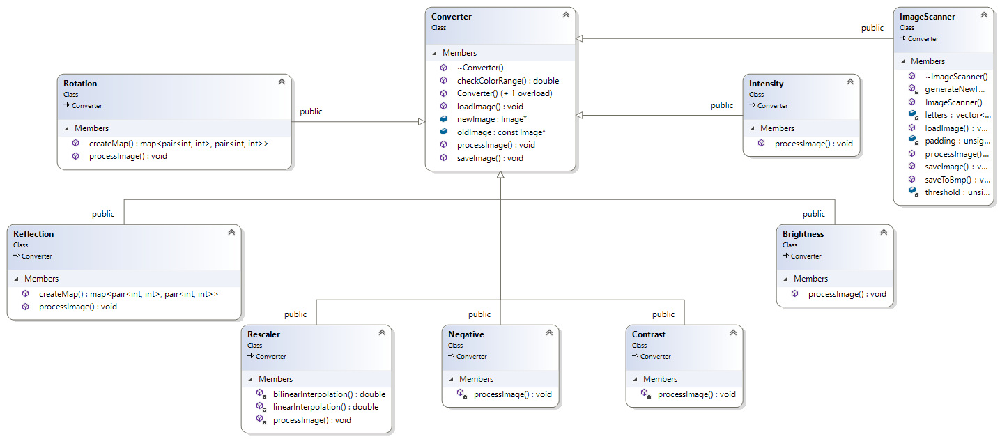

## Skład zespołu (gr. 208):
* Gustaw Daczkowski
* Wojciech Nowicki
* Adam Lisichin

Wybrane środowisko to Visual Studio 2019.

### Temat projektu:
Konwersja .bmp <-> pliki nagłowkowe pamieci (statyczna).
Wyświetlanie obrazów w formie tekstowej (ASCII).
Optymalizacja pamięci pod względem przechowywanego obrazu.

### Uruchamianie programu
* Program będzie uruchamiany z wiersza poleceń poprzez podanie odpowiednich argumentów
* W przypadku niepodania argumentów program będzie działał w trybie pilotażowym (wprowadzanie opcji po kolei)
* Program będzie wyświetlał dynamicznie formułowaną pomoc.

### Literatura

 [Struktura pliku BMP](http://www.ue.eti.pg.gda.pl/fpgalab/zadania.spartan3/zad_vga_struktura_pliku_bmp_en.html)

#### Aktualny podział pracy:
* Klasa `UserInterface` odpowiedzialna za dynamiczny CLI - Wojciech Nowicki
* Klasy `Parameter` oraz dziedziczące z nich - odpowiadają za opcjonalne parametry CLI - Wojciech Nowicki
* Klasa `Argument` oraz dziedziące z niej - odpowiadają za przekazywanie argumentów konwersji z CLI do `Converter` - Wojciech Nowicki
* Klasa `Image` odpowiadająca za zarządzanie zdjęciami jako interfejs dla innych klas (nadrzędna) - Gustaw Daczkowski
* Klasa `Converter` klasa główna odpowiedzialna za konwersję, z wirtualnymi metodami (plus wszystkie konwersje: Reflection, Rotation, Enhancer, Rescaler) - Adam Lisichin
* Klasa `Utils`- bardzo mała, znajdują się w niej statyczne metody do obsługi operacji bitowych oraz bajtowych - Gustaw Daczkowski
* Klasa `File` - odpowiedzialna za pracę nad plikami (plus dziedziczące z niej) - Gustaw Daczkowski
* Klasa `ImageContent` - odpowiedzialna za zarządzanie pamięcią (plus dziedziczące z niej) - Gustaw Daczkowski

#### Testy jednostkowe:
* Do testowania został użyty `MicrosoftCppUnitTestFramework`. Wszystkie testy znajdują się w oddzielnym projekcie `tests`.
* Jednostkowo są wybrane metody z wybranych klas (to co się da, choć jeszcze nie wszystko)

#### Aktualna funkcjonalność programu:
* CLI reaguje na komendę --help i wyświetla pomoc dla użytkownika, przy każdej źle wpisanej komendzie  
również wyśtwietla pomoc, CLI jest gotowy do rejestracji kolejnych funckjonalności programu.
* CLI obsługuje dwie komendy konwersji zdjęć:
    1. **Obrót o zadany kąt:** rotation kat "scieżka wejściowa" ["scieżka wyjściowa"] [-d]
    2. **Odbicie lustrzane:**  reflection ytyb "scieżka wejściowa" ["ścieżka wyjściowa"] [-d]
    3. **Rescaler - skalowanie obrazu** rescaler xskala yskala "sciezka wejsciowa" ["sciezka wyjsciowa"] [-d] 
* Oprócz tego jest klasa `Enhancer` - nieobsługiwana z CLI, opsiana w #13 z przykładami.
    

* Obecnie obsługiwane jest odczytywanie i pisanie do plików .bmp w wersji 24 oraz 1 bpp, podobnie w przypadku pliku nagłowkowego .h. Zaimplementowane są również konwersje między nimi.
Tj. można przekonwertować znak z fontu .h do .bmp oraz odwrotnie plik .h z dowolnego .bmp. Konwersja wszystkich znaków z fontu do .bmp nie jest zaimplementowana.
* Odczyt fontu z pliku .h następuje poprzez podanie ścieżki z dopiskiem `_x` gdzie x to znak odpowiadający znakowi z fontu. Np. `arialdig_0.h` - wczytanie cyfry `0` z fontu Arial.

### Przykładowe użycie programu:
* `graphic-file-converter.exe 90 "../sample_bmps/10x10.bmp" -d` - obrót zdjęcia 10x10.bmp o 90 stopni w prawo.
Podanie opcjonalnego parametru `-d` powoduje wyświetlenie zdjęcia na ekranie konsoli.
* `graphic-file-converter.exe reflect 2 "../sample_bmps/10x10.bmp" "../sample_bmps/output.bmp"` odbicie symetryczne względem prostej y=x i zapis do pliku output.bmp.
* `graphic-file-converter.exe help` wyświetlenie pomocy
* `graphic-file-converter.exe scale 2 2 "../sample_bmps/10x10.bmp" "../sample_bmps/out.bmp" -d` przeskalowanie obrazu x2 w osi X i Y wraz z wyświetleniem go w konsoli
* `graphic-file-converter.exe scale 2 2 "../sample_bmps/arialDig32x24_0.h" "../sample_bmps/out.bmp" -d` przeskalowanie obrazu tj. cyfry 0 z fontu Arial x2 w osi X i Y i zapis do pliku .bmp wraz z wyświetleniem go
w konsoli

Szczegółowe objaśnienia komend znajdują się w #11, #15.  
Szczegółowe objaśnienia funkcjonalności klasy `Image` znajdują się w #10.  
Szczegółowe objaśnienia funkcjonalności klasy `ImageContent`, `File` oraz pochodnych znajdują się w #14.  
Szczegółowe objaśnienia trybów konwersji znajdują się w #9, #13, #16.

## Diagramy klas:
### Converter i pochodne:

### Arguments oraz Parameters i pochodne:

### File i pochodne:

### ImageContent i pochodne:

## Hierarchia nadrzędna 
(romby oznaczają kompozycję, a zamalowane strzałki oznaczają relację nadrzędności ale bez dziedziczenia)

