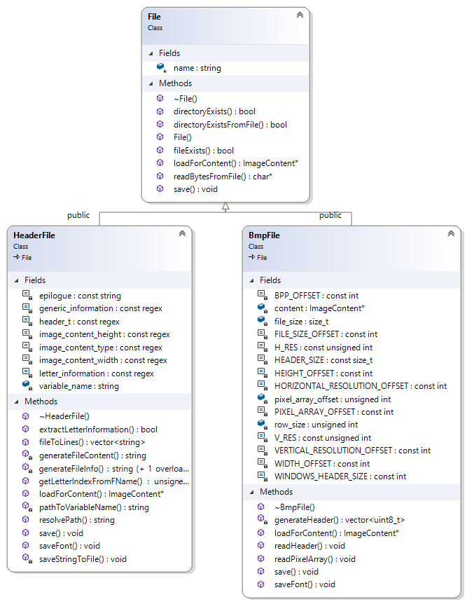

## Skład zespołu (gr. 208):
* Gustaw Daczkowski
* Wojciech Nowicki
* Adam Lisichin

Wybrane środowisko to Visual Studio 2019.

### Temat projektu:
Konwersja .bmp <-> pliki nagłowkowe pamieci (statyczna).
Wyświetlanie obrazów w formie tekstowej (ASCII).
Optymalizacja pamięci pod względem przechowywanego obrazu.

### Uruchamianie programu
* Program będzie uruchamiany z wiersza poleceń poprzez podanie odpowiednich argumentów
* W przypadku niepodania argumentów program będzie działał w trybie pilotażowym (wprowadzanie opcji po kolei)
* Program będzie wyświetlał dynamicznie formułowaną pomoc.

### Literatura

 [Struktura pliku BMP](http://www.ue.eti.pg.gda.pl/fpgalab/zadania.spartan3/zad_vga_struktura_pliku_bmp_en.html)

#### Aktualny podział pracy:
* Klasa `UserInterface` odpowiedzialna za dynamiczny CLI - Wojciech Nowicki
* Klasy `Parameter` oraz dziedziczące z nich - odpowiadają za opcjonalne parametry CLI - Wojciech Nowicki
* Klasa `Argument` oraz dziedziące z niej - odpowiadają za przekazywanie argumentów konwersji z CLI do `Converter` - Wojciech Nowicki
* Klasa `Image` odpowiadająca za zarządzanie zdjęciami jako interfejs dla innych klas (nadrzędna) - Gustaw Daczkowski
* Klasa `Converter` klasa główna odpowiedzialna za konwersję, z wirtualnymi metodami (plus wszystkie konwersje: `Reflection`, `Rotation`, `Rescaler`, `Negative`, `Brightness`, `Contrast`, `Intensity`) - Adam Lisichin
* Klasa `Utils`- bardzo mała, znajdują się w niej statyczne metody do obsługi operacji bitowych oraz bajtowych - Gustaw Daczkowski
* Klasa `File` - odpowiedzialna za pracę nad plikami (plus dziedziczące z niej) - Gustaw Daczkowski
* Klasa `ImageContent` - odpowiedzialna za zarządzanie pamięcią (plus dziedziczące z niej) - Gustaw Daczkowski
* Klasa `Font` - zawiera metody pomocniczne do operowania na skanowaniu plików z fontami - Gustaw Daczkowski

#### Testy jednostkowe:
* Do testowania został użyty `MicrosoftCppUnitTestFramework`. Wszystkie testy znajdują się w oddzielnym projekcie `tests`.
* Jednostkowo są wybrane metody z wybranych klas (to co się da, choć jeszcze nie wszystko)

#### Aktualna funkcjonalność programu:
*7 konwersji dostępnych za pomocą komend oraz tryb "za rękę" ułatwiający obsługę programu

### Przykładowe użycie programu:
* `graphic-file-converter.exe reflect 2 '../sample_bmps/10x10.bmp' '../sample_bmps/output.bmp'` odbicie symetryczne względem prostej y=x i zapis do pliku output.bmp.
* `graphic-file-converter.exe help` wyświetlenie pomocy
* `graphic-file-converter.exe scale 2 2 '../sample_bmps/10x10.bmp' '../sample_bmps/out.bmp' -d` przeskalowanie obrazu x2 w osi X i Y wraz z wyświetleniem go w konsoli
* `graphic-file-converter.exe scale 2 2 '../sample_bmps/arialDig32x24_0.h' '../sample_bmps/out.bmp' -d` przeskalowanie obrazu tj. cyfry 0 z fontu Arial x2 w osi X i Y i zapis do pliku .bmp wraz z wyświetleniem go
w konsoli
* `graphic-file-converter.exe scan 1 45 '../font_bmps/bernardT.bmp' '../sample_bmps/found_letters/Bernard_font' -b` - przeskanowanie zdjęcia bernardT.bmp, zapis do pliku nagłówkowego o nazwie Bernard_font.h. Padding = 1, Próg = 45

Szczegółowe objaśnienia komend znajdują się w #11, #15.  
Szczegółowe objaśnienia funkcjonalności klasy `Image` znajdują się w #10.  
Szczegółowe objaśnienia funkcjonalności klasy `ImageContent`, `File` oraz pochodnych znajdują się w #14.  
Szczegółowe objaśnienia trybów konwersji znajdują się w #9, #13, #16, #17.

#### Konwersje - Adam Lisichin
Klasa `Converter` jest klasą matką dla wszystkich niżej wymienionych konwersji.  
Klasy odpowiedzialne za poszczególne konwersje dziedziczą po klasie `Converter`, wszystkie posiadają korzystają z metody wirtualnej processImage(args), której wywołanie powoduje dokonanie operacji na nowo utworzonym zdjęciu.  

`Rotation` – odpowiedzialna za obsługę obrotu bitmapy o pewien kąt zgodnie z ruchem wskazówek zegara (można podać dowolną wielokrotność 90 stopni - podanie innej wartości poskutkuje wyrzuceniem błędu).  
    Algorytm obsługuje zarówno zdjęcia 24bpp jak i 1bpp.  
    Dostępne wywołania:  
    - **90** - obrót o 90 stopni  
    - **180** - obrót o 180 stopni  
    - **270** - obrót o 270 stopni  
    Dla **0** i **360** stopni (oraz całkowitych wielokrotności) zwracane jest domyślne zdjęcie.  

`Reflection` – odpowiedzialna za obsługę lustrzanego odbicia.  
    Algorytm obsługuje zarówno zdjęcia 24bpp jak i 1bpp.  
    Dostępne wywołania:  
    - **0** - odbicie lustrzane w pionie  
    - **1** - odbicie lustrzane w poziomie    
    *Tylko dla kwadratowych zdjęć:*  
    - **2** - odbicie lustrzane względem przekątnej (y = x)  
    - **3** - odbicie lustrzane względem drugiej przekątnej (y = height - x)    

Klasy Rotation i Reflection powstały jako pierwsze. Dzielą ten sam mechanizm budowania mapy współrzędnych. Posiadają następujące metody:  
    **createMap** - tworzy mapę par liczb całkowitych, która przechowuje pary koordynatów przed i po konwersji.  
    Konwersja dokonywana jest w oparciu o algorytmy napisane i przetestowane ręcznie.  
    Jego działanie potwierdzają testy jednostkowe i obrazy wygenerowane w wyniku konwersji.  
    - w klasie `Rotation`: wykorzystana została macierz obrotu i translacja o wektor  
    - w klasie `Reflection`: współrzędne obliczane są ze wzoru wynikającego z symetrii względem prostej (pionowej, poziomej, skośnej) a następnie dokonywana jest translacja o wektor  
    **processImage** - inicjalizuje mapę konwersji i na jej podstawie wypełnia nowe zdjęcie starymi pixelami ale na odpowiednich współrzędnych.  
    - w klasie `Rotation`: następuje zamiana wymiarów nowego zdjęcia dla kątów różnych od 180, dla 0 i 360 zdjęcie nie ulega zmianom.  
    - w klasie `Reflection`: następuje sprawdzenie warunków. Nie dozwolone jest wykonanie symetrii względem przekątnych dla prostokątów nie będących kwadratem.  

`Rescaler` - pozwala na skalowanie obrazu (zarówno w pionie jak i poziomie)  
    **processImage** - przyjmuje dwa argumenty - scale_x i scale_y; jeżeli chcemy skalować tylko w jednej płaszczyźnie, to należy wpisać 1 przy drugiej.  
    Skalowanie obrazu jest możliwe dzięki algorytmowi interpolacji bilinearnej - literatura w #13  
    Klasa zawiera metody *linearInterpolation* i *bilinearInterpolation*, z użyciem których wyliczane są nowe współrzędne pixeli i przypadające im kolory.  
    Algorytm obsługuje zarówno zdjęcia 24bpp jak i 1bpp.  

`Brightness` - pozwala zmienić jasność zdjęcia (zwiększenie/zmniejszenie wszystkich składowych RGB).  
    **processImage**  - przyjmuje liczbę całkowitą od -255 do 255, o którą zostanie zwiększona jasność zdjęcia (czyli wartość składowej R, G i B jednocześnie)  
    Funkcja posiada ochronę przed wykroczeniem poza zakres [0, 255] - checkColorRange z Convertera.  
    Konwersja działa tylko dla 24bpp.  

`Contrast` - modyfikuje kontrast zdjęcia.  
    **processImage**  - przyjmuje liczbę calkowitą od 0 do 255, dzięki której zmienimy wartość kontrastu (obliczanego ze wzoru na kontrast)  
    Funkcja posiada ochronę przed wykroczeniem poza zakres [0, 255] - checkColorRange z Convertera.
    Konwersja działa tylko dla 24bpp.  

`Intensity` - pozwala zmienić wartości wybranych kanałów R G B.  
    **processImage**  - przyjmuje trzy argumenty:    
    R - zmiana intensywności składowej koloru czerwonego o podaną wartość  
    G - zmiana intensywności składowej koloru zielonego o podaną wartość   
    B - zmiana intensywności składowej koloru niebieskiego o podaną wartość  
    Konwersja oczywiście działa tylko dla 24bpp.  
    Funkcja posiada ochronę przed wykroczeniem poza zakres [0, 255] - checkColorRange z Convertera.  

`Negative` - tworzy negatyw obrazu.  
    **processImage**  - nie przyjmuje żadnych parametrów.  
    Zamienia wartości składowych R G B na ich dopełnienie do 255.  
    Funkcja posiada ochronę przed wykroczeniem poza zakres [0, 255] - checkColorRange z Convertera.  

#### Command Line Interface - Wojciech Nowicki  

Klasa `UserInterface` - odpowiada za komunikację z użytkownikiem  
    **registerAction** - system rejestrowania funkcjonalności pozwala w łatwy sposób rozszerzać możliwości programu  
    **showHelp** - umożliwia dynamiczne tworzenie i wyświetlanie pomocy na bazie funkcjonalności zarejestrowanych w klasie  
    **registerParameter** - system rejestrowania parametrów, pozwala na ich szybkie i proste dodawanie  

Klasa `Arguments` i zniej dziedziczące - pozwalają na tworzenie spersonalizowanych argumentych dla konkretnych konwersji  
    **set_arguments** - na podstawie dostarczonego wektora, przpisuje wartości do odpowiednich miejsc  

Klasa `Parameter` i zniej dziedziczące - pozwala na tworzenie parametrów wykonujących dodatkowe operacje na zdjęciach  
    **executeParam** - na podstawie dostarczonego rodzaju konwersji, wykonuje funkcje parametru  

#### Skanowanie zdjęć - Gustaw Daczkowski

Za całość odpowiada klasa `ImageScanner` dziedzicząca z `Converter`

Założenia zdjęcia wejściowego:
* Musi zawierać litery A-Z oraz cyfry 0-9 w odpowiedniej, alfabetycznej kolejności (w sumie 36 znaków).
* Znaki te muszą być oddzielone niezerowymi odstępami (litery nie mogą na siebie nachodzić)
* Zdjęcie wejściowe może być w formacie 1bpp albo 24bpp (inne nie są obsługiwane przez konwerter)

Komenda `scan P(int) T(int)` - przyjmuje dwa argumenty liczbowe:
* Pierwszy to padding - zarówno z lewej jak i z prawej oznacza ile białych pikseli będzie dodanych do znaku
* Drugi to threshold (próg) - w przypadku zdjęć o rozdzielczości >=8bpp jest to próg poniżej którego dany piksel zostaje uznany za czarny (max 255)

Dalej komenda podobnie jak inne przyjmuje ścieżki:
* wejściową (do pliku .bmp do przeskanowania)
* wyjściową - tutaj należy podać ścieżkę do pliku, ale bez rozszerzenia np. `results/fontArial` - program domyślnie doda .h na końcu pliku

Istnieje również opcjonalny parametr `-b`, który powoduje wygenerowanie plików .bmp dla każdego ze znaków o nazwach np. fontArial_A.bmp (te pliki są w formacie 1bpp)

## Diagramy klas:
### Converter i pochodne:

### Arguments oraz Parameters i pochodne:

### File i pochodne:

### ImageContent i pochodne (na zielono zaznaczona klasa do dokończenia - 16bpp):

## Hierarchia nadrzędna 
(romby oznaczają kompozycję, a zamalowane strzałki oznaczają relację nadrzędności ale bez dziedziczenia)

